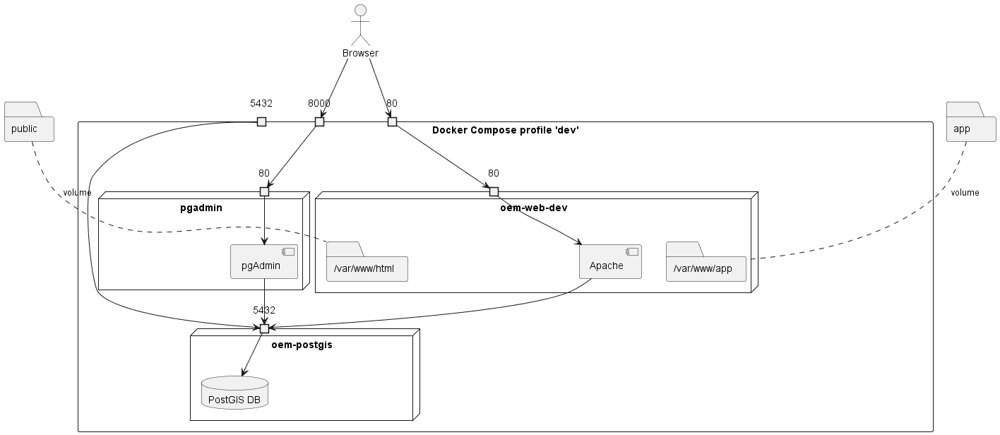
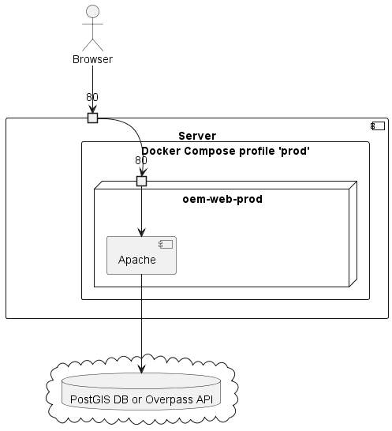

# Contributing to OSM-Wikidata Map Framework

**Any suggestion to improve this documentation page is really appreciated**, as it helps more newcomers to contribute to the map and more in general to the OSM and Wikidata projects.
You can edit it and open a merge request or you can open a new issue on [GitLab](https://gitlab.com/openetymologymap/osm-wikidata-map-framework/-/issues/new) or [GitHub](https://github.com/Danysan1/osm-wikidata-map-framework/issues) describing your suggestion.

You can find below some information useful to contribute to the OSM-Wikidata Map Framework codebase.

### Helping with translation

The translations for the title and description of the specific instance of OWMF is located in the `i18n_override` configuration.
For example, the title and description of Open Etymology Map are located in the [`.env.example` file in its repository](https://gitlab.com/openetymologymap/open-etymology-map/-/blob/main/.env.example).

All other translations are located in the [`public/locales/{LANGUAGE_CODE}/common.json`](public/locales/) files of the framework.
**You can translate this framework in new languages or fix errors in existing translations [on Transifex](https://app.transifex.com/osm-wikidata-maps/osm-wikidata-map-framework/dashboard/)**.

### Architecture info for contributors

#### Excluded elements

OWMF makes the choice to remove extremely big elements when fetching from OpenStreetMap for two reasons:

- They are often complex and heavy to download, elaborate and store from both a time and space point of view. Downloading the data for a small city without excluding containing areas can easily lead to download hundreds of megabytes, causing very long elaboration times on the back-end and causing almost all front-end user devices to hang or crash
- They hinder visualization of small elements. Map are always approximations of reality and it's normal to hide big elements at high zoom and most small elements at low zoom, in order to not overload the user with too many items. Being OWMF designed to show details only at high zoom it's appropriate to remove very big elements.

Tags causing elements to be removed include:

- `boundary=*`
- `type=boundary`
- `sqkm=*` (ex: [Persian Gulf](https://www.openstreetmap.org/relation/9326283), [Lake Superior](https://www.openstreetmap.org/relation/4039486))
- `end_date=*` or `route=historic`

This filtering is done in [OwmfFilterDAG](airflow/dags/OwmfFilterDAG.py) for the DB data and by [OverpassService](src/services/OverpassService.ts) for Overpass data.

#### Deployment

In order to make a deployed instance function correctly all instance settings must be set in `.env`.

You can copy the template file [`.env.example`](.env.example), while other options should already be ok as a starting point.

If you expose your app on a domain/address different than localhost or 127.0.0.1 you will also need to specify a token/key for the background map (either `mapbox_token`, `maptiler_key`, `enable_stadia_maps` or `jawg_token`).

If you want to use [Sentry](https://sentry.io/welcome/) you need to create a JS and/or PHP Sentry project and set the `sentry-*` parameters according with the values you can find in `https://sentry.io/settings/_ORGANIZATION_/projects/_PROJECT_/keys/` and `https://sentry.io/settings/_ORGANIZATION_/projects/_PROJECT_/security-headers/csp/`.

#### Local development with Docker

During development you can run a local instance of OSM-Wikidata Map Framework with Docker by running `docker-compose --profile dev up -d` in the project root. This will start

- An instance of the app exposed at http://localhost:80
- A PostgreSQL+PostGIS DB exposed on `localhost:5432`
- A PGAdmin instance exposed at http://localhost:8080

<details>
<summary>Deployment diagram</summary>



| Local folder                 | Destination folder   | Development service                                                             | Production service                                |
| ---------------------------- | -------------------- | ------------------------------------------------------------------------------- | ------------------------------------------------- |
| [airflow/dags](airflow/dags) | `/opt/airflow/dags`  | `airflow-webserver`, `airflow-scheduler`, `airflow-worker`, `airflow-triggerer` |                                                   |
| [app](app)                   | `/var/www/app`       | `owmf-web-dev` (mapped via volume)                                               | `owmf-web-prod` (copied during build)              |
| [public](public)             | `/var/www/html`      | `owmf-web-dev` (mapped via volume)                                               | `owmf-web-prod` (copied during build)              |
| [src](src)                   | `/var/www/html/dist` | `owmf-web-dev` (compiled)                                                        | `owmf-web-prod` (compiled and copied during build) |
| [promtail](promtail)         | `/etc/promtail`      |                                                                                 | `promtail` (mapped via volume)                    |

</details>

Visual Studio Code users [can use Dev Containers](https://code.visualstudio.com/docs/remote/containers) to develop directly inside the local development instance.

#### Production deployment with Docker

The latest version can be deployed through Docker using the image [`registry.gitlab.com/openetymologymap/osm-wikidata-map-framework`](https://gitlab.com/openetymologymap/osm-wikidata-map-framework/container_registry/3032190).
```sh
docker run --rm -d  -p 80:80/tcp registry.gitlab.com/openetymologymap/osm-wikidata-map-framework:latest
```

A full installation without DB (using Overpass) can be deployed with docker-compose:
```sh
git clone https://gitlab.com/openetymologymap/osm-wikidata-map-framework.git
cd osm-wikidata-map-framework
cp ".env.example" ".env"
# At this point edit the .env file with the desired settings
docker-compose --profile "prod" up -d
```

A full installation complete with DB can be deployed with docker-compose:
```sh
git clone https://gitlab.com/openetymologymap/osm-wikidata-map-framework.git
cd osm-wikidata-map-framework
cp ".env.example" ".env"
# At this point edit the .env file with the desired settings and set db_enable=true
COMPOSE_PROFILES=prod,db docker-compose up -d
```
At this point you need to load a dump of the DB on the DB exposed on localhost:5432 or initialize it [through the Airflow pipeline](#database-initialization)

<details>
<summary>Deployment diagram</summary>




</details>

#### Front-end

The front-end code is composed by [index.php](public/index.php) and the Typescript code under the [src folder](src/).
The map is created using [MapLibre GL JS](https://maplibre.org/projects/maplibre-gl-js/) and the charts are created using [chart.js](https://www.chartjs.org/).

At very low zoom level (zoom < [`min_zoom_level`](.env.example)) clustered element counts are shown only for PMTiles and Vector DB sources.

At low zoom level (zoom < [`threshold_zoom_level`](.env.example)) clustered element counts are shown fol all sources.

At high zoom level (zoom > [`threshold_zoom_level`](.env.example)) actual elements and their etymologies are shown.

The API code used to connect to Overpass, WDQS and other APIs is automatically generated from the OpenAPI specification files in [`openapi/`](openapi/) through `npm run generate` into [`src/generated/`](src/generated/).

#### Back-end (v2, using PostGIS DB)

An Apache Airflow pipeline defined in [ariflow/dags/](airflow/dags/db-init-planet.py) is regularly run to download the latest OSM data, initialize the [PostgreSQL](https://www.postgresql.org/)+[PostGIS](https://postgis.net/) DB and get the linked entities and export the result to a PMTiles file used by the front-end.

This pipeline starts from a .pbf file ([a local extract](http://download.geofabrik.de/) in testing or [a full planet export](https://planet.openstreetmap.org/) in production), filters it with [`osmium tags-filter`](https://docs.osmcode.org/osmium/latest/osmium-tags-filter.html), exports it to a tab-separated-values file with [`osmium export`](https://docs.osmcode.org/osmium/latest/osmium-export.html) and imports it into the DB. [osm2pgsql](https://osm2pgsql.org/) is also supported in place of `osmium export` but the former is typically used. Then OSM etymologies are extracted and Wikidata etymologies are downloaded. If enabled, propagation is executed. Finally the data is exported to PMTiles through ogr2ogr+[Tippecanoe](https://github.com/felt/tippecanoe) or uploaded to a remote DB with pg_dump+pg_restore. 

To run the database initialization:

1. make sure [`docker-compose` is installed](#local-development-with-docker)
2. initialize `.env` from [`.env.example`](.env.example) as shown [above](#configuration)
3. the first time run `docker-compose --profile airflow-init up`, then for each sequent time start Apache Airflow with `docker-compose --profile airflow up -d`
4. from the Apache Airflow configuration menu in the dashboard located at http://localhost:8080 create the Pool `data_filtering`
5. run/enable an existing DAG pipeline (if necessary customizing the launch config)
6. the data for OSM-Wikidata Map Framework will be stored in the `owmf` schema of the DB you configured in `.env` (and, if specified in the destination DB)

IMPORTANT NOTE: If you use the planet file I suggest to use a machine with 16GB of RAM (and a lot of patience, it will require more than 6 hours; use a local extract in development to use less RAM and time, for an example see [db-init-italy-nord-ovest.py](airflow/dags/db-init-italy-nord-ovest.py)).

Tip: if you run the local development instance through `docker-compose` you can connect to the local DB ([configured by default in `.env`](.env.example)) by using PGAdmin at http://localhost:8000 .

<details>
<summary>Database initialization steps diagram</summary>


</details>

##### Propagation

If the propagation is enabled, the database initialization operates as follow:

1. load all highways with a name, even if they have no etymology
2. find the etymologies os elements on the map through the methods cited above from OSM and Wikidata
3. case insensitively search names used by at least two highways far away from each other which have exactly and only the same etymology
4. propagates these etymologies to all (case insensitively) homonymous highways

More specifically, this procedure is handled by [`OwmfDbInitDAG`](airflow/dags/OwmfDbInitDAG.py#L424) and [propagate-etymologies-global.sql](airflow/dags/sql/propagate-etymologies-global.sql).
