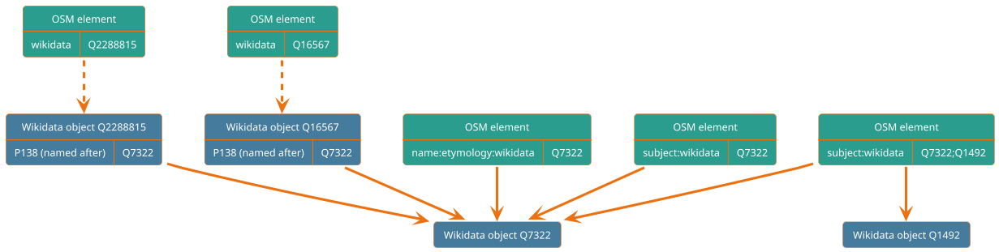
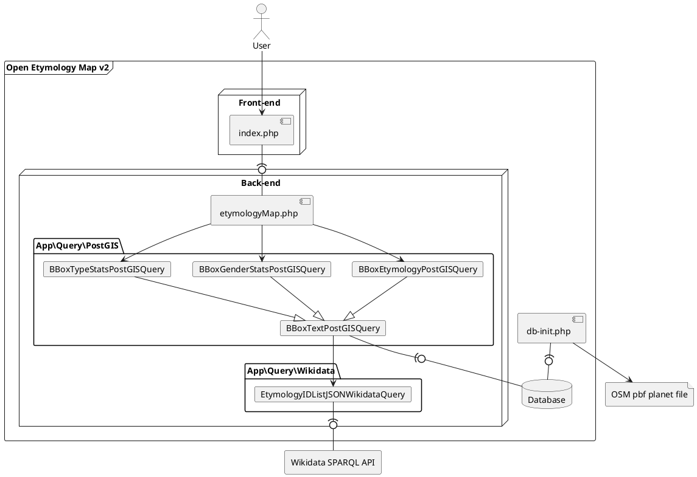
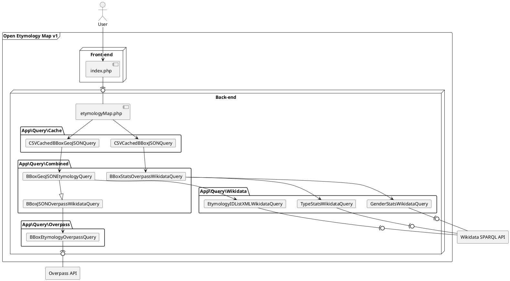

# Contributing to Open Etymology Map

## How to contribute to the background map

The background map is provided by Mapbox, which is itself based on OpenStreetMap. You can improve the map on [openstreetmap.org](https://www.openstreetmap.org/).
You can learn how to map on [the official welcome page](https://www.openstreetmap.org/welcome) and on [LearnOSM](https://learnosm.org/).

## How to report a problem in the etymology of an element

If the etymology associated to the element is correct but there is a problem in the details (birth date, nationality, ...):
1. From the etymology window click on the "Wikidata" button for the incorrect etymology
2. At the top of the opened page click on "Discussion"
3. Append in the opened text box the description of the problem you found in the data
4. Confirm your comment by clicking on the blue button below

If the problem is related to the etymology itself (a wrong etymology is associated to the element):
1. From the etymology window click on the "OpenStreetMap" button
2. On the left of the opened page check if the `name:etymology:wikidata` or `subject:wikidata` tag is present. If it is, click on the dialog button on the right to add a note to the map and describe the problem
3. If the tags above are absent, the `wikidata` tag will be present and its value will be clickable. Click on it.
4. If the opened page represents the element from the map (not its etymology, not something else):
   1. At the top of the opened page click on "Discussion"
   2. Append in the opened text box the description of the problem you found in the etymology for the object
   3. Confirm your comment by clicking on the blue button below
5. If instead the opened page represents something else, go back to the OpenStreetMap page, click on the button on the right to add a note to the map and write that the `wikidata` tag points to the wrong element

## How to contribute to the etymology data

Open Etymology Map gets the etymology of elements on the map from [OpenStreetMap](https://www.openstreetmap.org/welcome) and information about the etymology subjects from [Wikidata](https://www.wikidata.org/wiki/Wikidata:Introduction).

If you wish to add or correct the etymology for an element for the map you can do it on [openstreetmap.org](https://www.openstreetmap.org/).
You can learn how to map on [the official welcome page](https://www.openstreetmap.org/welcome) and on [LearnOSM](https://learnosm.org/).

The wikidata ID of an object/person/... can be found by searching its name on [wikidata.org](https://www.wikidata.org/wiki/Wikidata:Main_Page), once the subject will be opened its alphanumeric ID will be both on the right of the title and in the URL.

Suppose for example that you want to tag something named after Nelson Mandela: after searching it on wikidata you will find it's page at https://www.wikidata.org/wiki/Q8023 . As can be seen from the URL, it's ID is `Q8023`.



To add the etymology to an element:

1. Find the element of interest on OpenStreetMap
2. If the element has a [`name:etymology:wikidata`](https://wiki.openstreetmap.org/wiki/Key:name:etymology:wikidata) or [`subject:wikidata`](https://wiki.openstreetmap.org/wiki/Key:subject) tag then the element should already be available on Open Etymology Map.
   - If the tags are present but the element isn't available on OEM, the tag value may contain an error, like not being a valid Wikidata ID.
   - If it is available on OEM but with the wrong etymology, search on Wikidata the ID for the correct etymology and edit the incorrect tag with the new ID.
3. If the element has a `wikidata` tag check the referenced Wikidata element.
   - If it does not represent the same real world object of the OSM element, search the correct one and change it. 
   - If it contains a ["named after"](https://www.wikidata.org/wiki/Property:P138) or ["dedicated to"](https://www.wikidata.org/wiki/Property:P825) relation check that it links to the correct etymology. If it is absent, add it:
     1. Click "+ Add statement"
     2. On the left choose `P138` ("named after") or `P825` ("dedicated to") (depending on which is more appropriate) as property
     3. On the right search the desired etymology to use as the value
4. If none of these tags is present, you can either:
   - Link the Wikidata object for the etymology to the element
     1. Search the etymology on Wikidata
     2. If the Wikidata element for the etymology is not available you can create it [on this Wikidata page](https://www.wikidata.org/wiki/Special:NewItem) using the instructions on that page.
     3. Add to the OpenStreetMap element the [`name:etymology:wikidata`](https://wiki.openstreetmap.org/wiki/Key:name:etymology:wikidata) or [`subject:wikidata`](https://wiki.openstreetmap.org/wiki/Key:subject) tag (depending on the meaning of the etymology) with the Wikidata ID as value. Using the example above, if you want to state an element is named after Nelson Mandela you will need to add the tag `name:etymology:wikidata`=`Q8023`.
   - If it is available link the Wikidata object for the element to the element and to the etymology object
     1. Search the Wikidata object for the element
     2. If it is available add it to the element through the `wikidata` tag (tools like https://osm.wikidata.link/ may help you in this process)
     3. Add the "named after" or "dedicated to" property to the Wikidata object as shown above

## How to contribute to Open Etymology Map

Any suggestion to improve this documentation page is really appreciated, as it helps more newcomers to contribute to the map and more in general to the OSM and Wikidata projects. You can edit it and open a merge request or you can [open a new issue](https://gitlab.com/dsantini/open-etymology-map/-/issues/new) describing your suggestion.

You can find below some information useful to contribute to the Open Etymology Map codebase.

### Deployment

The default production instance is https://etymology.dsantini.it and the development instance is https://etymology-test.dsantini.it .
During development you can run a local instance of Open Etymology Map using the [instructions you will find below](#local-development-with-docker).

#### Configuration

In order to make a deployed instance function correctly all instance settings must be set in `open-etymology-map.ini`.

A template for this config file can be found in [`open-etymology-map.template.ini`](open-etymology-map.template.ini). When copying the template `.ini` you must set `mapbox-gl-token`, while other options should already be ok as a starting point.

If you want to use [Sentry](https://sentry.io/welcome/) you need to create a JS and/or PHP Sentry project and set the `sentry-*` parameters according with the values you can find in `https://sentry.io/settings/_ORGANIZATION_/projects/_PROJECT_/keys/` and `https://sentry.io/settings/_ORGANIZATION_/projects/_PROJECT_/security-headers/csp/`.
If you enable Sentry JS on the frontend remember to add `www.google.*` and `inline` in your project's settings `Security Headers` > `CSP Instructions` (`https://sentry.io/settings/_ORGANIZATION_/projects/_PROJECT_/security-headers/csp/`) > `Additional ignored sources` or you will quickly burn through your quota because of irrelevant CSP messages.

#### Local development with Docker

A local development instance can be started with Docker by running `docker-compose up` in the project root. This will start
- An instance of Open Etymology exposed at http://localhost:80
- A PostgreSQL+PostGIS DB exposed on localhost:5432
- A PGAdmin instance exposed at http://localhost:8080

Visual Studio Code users [can use Dev Containers](https://code.visualstudio.com/docs/remote/containers) to develop directly inside the local development instance.

#### Production deployment with Docker

The latest version can be deployed through Docker using the image `registry.gitlab.com/dsantini/open-etymology-map` whose available tags are listed [here](https://gitlab.com/dsantini/open-etymology-map/container_registry/2165364).

```sh
docker run --rm -d  -p 80:80/tcp registry.gitlab.com/dsantini/open-etymology-map:latest
```

This image can be built with:

```sh
docker build --pull --rm -f "open-etymology-map.Dockerfile" -t "open-etymology-map" --target "prod" .
```

### Structure

#### Front-end

[index.php](web/index.php) and [index.js](web/index.js) create the map using [Mapbox GL JS](https://www.mapbox.com/mapbox-gljs).

Since v2, at very low zoom level (zoom < [`min-zoom-level`](open-etymology-map.template.ini)), clustered element count is shown from [`global-map.geojson`](https://etymology.dsantini.it/global-map.geojson) (generated by [db-init.php](web/db-init.php)).

At low zoom level ([`threshold-zoom-level`](open-etymology-map.template.ini) > zoom > [`min-zoom-level`](open-etymology-map.template.ini)) clustered count is obtained from the back-end with [elements.php](web/elements.php).

At high enough zoom level (zoom > [`threshold-zoom-level`](open-etymology-map.template.ini)) actual elements and their etymologies are obtained from the back-end with [etymologyMap.php](web/etymologyMap.php) .

#### New back-end (v2)



[db-init.php](web/db-init.php) is regularly run to initialize the [PostgreSQL](https://www.postgresql.org/)+[PostGIS](https://postgis.net/) DB with the latest OpenStreetMap elements and their respective wikidata etymology IDs.
This script starts from a .pbf file ([a local extract](http://download.geofabrik.de/) in testing or [a full planet export](https://planet.openstreetmap.org/) in production), filters it with [osmium](https://osmcode.org/osmium-tool/) [`tags-filter`](https://docs.osmcode.org/osmium/latest/osmium-tags-filter.html), exports it to a tab-separated-values file with [osmium](https://osmcode.org/osmium-tool/) [`export`](https://docs.osmcode.org/osmium/latest/osmium-export.html) and imports it into the DB. [osm2pgsql](https://osm2pgsql.org/) is also supported in place of `osmium export` but the former is typically used.

Once the DB is initialized, this is the data gathering process in [etymologyMap.php](web/etymologyMap.php) used by in v2 if the configuration contains `db-enable = true`:

1. [`BBoxTextPostGISQuery::downloadMissingText()`](web/app/query/postgis/BBoxTextPostGISQuery.php) checks if the Wikidata content for the requested area has already been downloaded in the DB
    - If it has not been downloaded it downloads it downloads it using [EtymologyIDListJSONWikidataQuery](web/app/query/wikidata/EtymologyIDListJSONWikidataQuery.php) and loads it in the DB
2. [`BBoxEtymologyPostGISQuery`](web/app/query/postgis/BBoxEtymologyPostGISQuery.php) queries the DB and outputs the elements and their etymologies.

##### Database initialization

If you intend to use the DB you will need to initialize it first:
1. make sure [osmium](https://osmcode.org/osmium-tool/) and [psql](https://www.postgresql.org/docs/13/app-psql.html) are installed on your machine. If they are not you have two alternatives:
   - run a development instance through `docker-compose` [as shown above](#local-development-with-docker) and attach a shell to the [`web`](docker-compose.yml) service
   - [install osmium](https://osmcode.org/osmium-tool/) and [install psql](https://www.postgresql.org/download/)
2. initialize `open-etymology-map.ini` as shown [above](#configuration)
3. download [a .pbf extract](http://download.geofabrik.de/) or [a .pbf planet file](https://planet.openstreetmap.org/) with OSM data, depending on which area you want to show on the map.
4. using command line, move to the [web/](web/) folder (`/var/www/html/` if you are attached to the local `docker-compose` development instance) and run `php db-init.php YOUR_PBF_FILE_NAME.pbf`
5. the data for Open Etymology Map will be stored in the `oem` schema of the DB you configured in `open-etymology-map.ini`

IMPORTANT NOTE: If you use the planet file I suggest to use a machine with at least 16GB RAM (and a lot of patience, DB initialization may require some hours; use a local extract in development to use less RAM and time).

Tip: if you run the local development instance through `docker-compose` you can connect to the local DB (configured by default in [`open-etymology-map.template.ini`](open-etymology-map.template.ini)) by using PGAdmin at http://localhost:8080 .

#### Old back-end (v1)



Data gathering process in [etymologyMap.php](web/etymologyMap.php) used by in v1 (and in v2 if the configuration contains `db-enable = false`):

1. Check if the GeoJSON result for the requested area has already been cached recently.
   - If it is, serve the cached result ([CSVCachedBBoxGeoJSONQuery](web/app/query/cache/CSVCachedBBoxGeoJSONQuery.php)).
   - Otherwise it is necessary to fetch the data from OpenStreetMap through [Overpass API](https://wiki.openstreetmap.org/wiki/Overpass_API).
      1. Query Overpass API in the selected area to get elements with etymology ([BBoxEtymologyOverpassQuery](web/app/query/overpass/BBoxEtymologyOverpassQuery.php)).
      2. Transform the JSON result into GeoJSON ([OverpassEtymologyQueryResult](web/app/result/overpass/OverpassEtymologyQueryResult.php)).
      3. Obtain a set of Wikidata IDs to get information about ([GeoJSON2XMLEtymologyWikidataQuery](web/app/query/wikidata/GeoJSON2XMLEtymologyWikidataQuery.php)).
      4. Check if the XML result for the requested set of Wikidata IDs has already been cached recently.
         - If it is, use the cached result ([CSVCachedStringSetXMLQuery](web/app/query/cache/CSVCachedStringSetXMLQuery.php)).
         - Otherwise it is necessary to fetch the data from OpenStreetMap.
            1. Query the Wikidata SPARQL query service to get information on the elements whose IDs are in the set obtained from OSM ([EtymologyIDListXMLWikidataQuery](web/app/query/wikidata/EtymologyIDListXMLWikidataQuery.php)).
            2. Cache the XML result ([CSVCachedStringSetXMLQuery](web/app/query/cache/CSVCachedStringSetXMLQuery.php)).
      5. Obtain from the XML result from Wikidata a matrix of details for each element ([XMLWikidataEtymologyQueryResult](web/app/result/wikidata/XMLWikidataEtymologyQueryResult.php)).
      6. Match each element in the GeoJSON data with an etymology with its details from Wikidata ([GeoJSON2GeoJSONEtymologyWikidataQuery](web/app/query/wikidata/GeoJSON2GeoJSONEtymologyWikidataQuery.php)).
      7. Cache the GeoJSON result ([CSVCachedBBoxGeoJSONQuery](web/app/query/cache/CSVCachedBBoxGeoJSONQuery.php)).

#### Output
The output of [etymologyMap.php](web/etymologyMap.php) will be both in [v1](#old-back-end-v1) and in [v2](#new-back-end-v2) something similar to ...

```json
{
    "type": "FeatureCollection",
    "features": [
        ...
        
        {
            "type": "Feature",
            "geometry": {
                "type": "Point",
                "coordinates": [
                    22.54163,
                    51.24552
                ]
            },
            "properties": {
                "name": "Pomnik Marii Curie-Sk\u0142odowskiej",
                "@id": "node\/3005524964",
                "wikipedia": "en:Marie Curie Monument in Lublin",
                "etymologies": [
                    {
                        "wikidata": "http:\/\/www.wikidata.org\/entity\/Q7186",
                        "wikipedia": "https:\/\/en.wikipedia.org\/wiki\/Marie_Curie",
                        "commons": "Marie Curie",
                        "name": "Marie Curie",
                        "description": "Polish-French physicist and chemist (1867-1934)",
                        "instanceID": "http:\/\/www.wikidata.org\/entity\/Q5",
                        "gender": "female",
                        "genderID": "http:\/\/www.wikidata.org\/entity\/Q6581072",
                        "occupations": "nuclear physicist, university teacher, chemist, physicist",
                        "pictures": [
                            "http:\/\/commons.wikimedia.org\/wiki\/Special:FilePath\/Marie%20Curie%20c.%201920s.jpg"
                        ],
                        "event_date": null,
                        "start_date": null,
                        "end_date": null,
                        "birth_date": "1867-11-07T00:00:00Z",
                        "death_date": "1934-07-04T00:00:00Z",
                        "event_place": null,
                        "birth_place": "Warsaw",
                        "death_place": "Sancellemoz",
                        "prizes": "Nobel Prize in Physics, Nobel Prize in Chemistry",
                        "citizenship": "Poland, France, Russian Empire",
                        "wkt_coords": null
                    }
                ]
            }
        },
        ...
        {
            "type": "Feature",
            "geometry": {
                "type": "LineString",
                "coordinates": [
                    [
                        11.7023,
                        44.36173
                    ],
                    [
                        11.70262,
                        44.36161
                    ],
                    [
                        11.70271,
                        44.36158
                    ],
                    [
                        11.70334,
                        44.36134
                    ]
                ]
            },
            "properties": {
                "name": "Via Caduti di Cefalonia",
                "@id": "way\/22877448",
                "etymologies": [
                    {
                        "wikidata": "http:\/\/www.wikidata.org\/entity\/Q537576",
                        "wikipedia": "https:\/\/en.wikipedia.org\/wiki\/Massacre_of_the_Acqui_Division",
                        "commons": "Massacre of the Acqui Division",
                        "name": "massacre of the Acqui Division",
                        "description": "1943 mass execution of Italian soldiers",
                        "instanceID": "http:\/\/www.wikidata.org\/entity\/Q135010",
                        "gender": null,
                        "genderID": null,
                        "occupations": null,
                        "pictures": [
                            "http:\/\/commons.wikimedia.org\/wiki\/Special:FilePath\/Argostoli%20mnimeio%20Italon.JPG"
                        ],
                        "event_date": "1943-09-26T00:00:00Z",
                        "start_date": "1943-09-21T00:00:00Z",
                        "end_date": "1943-09-26T00:00:00Z",
                        "birth_date": null,
                        "death_date": null,
                        "event_place": "Kefalonia",
                        "birth_place": null,
                        "death_place": null,
                        "prizes": null,
                        "citizenship": null,
                        "wkt_coords": "Point(20.59 38.25)"
                    }
                ]
            }
        },
        ...
    ]
}
```
