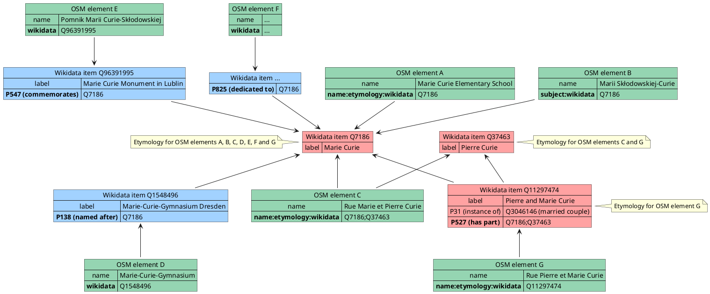
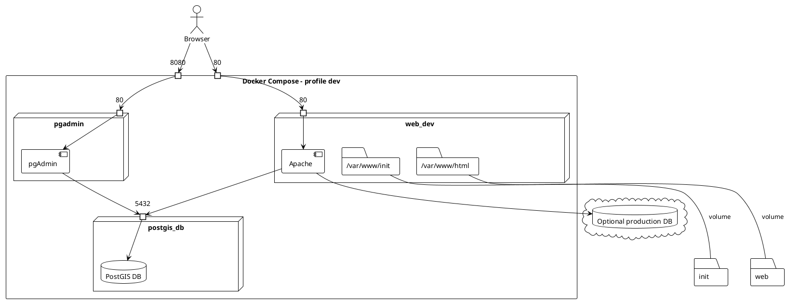
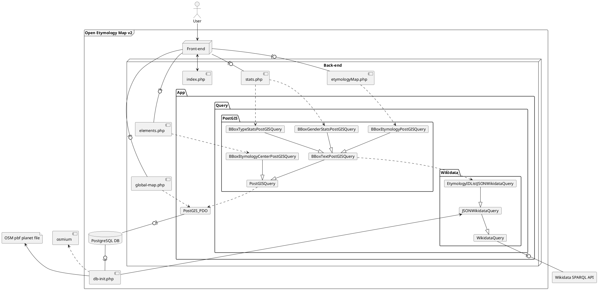

# Contributing to Open Etymology Map

## How to contribute to the background map

The background map is provided by Mapbox, which is itself based on OpenStreetMap. You can improve the map on [openstreetmap.org](https://www.openstreetmap.org/).
You can learn how to map on [the official welcome page](https://www.openstreetmap.org/welcome) and on [LearnOSM](https://learnosm.org/). Keep in mind that Mapbox doesn't update the map every month so if you edit something on OpenStreetMap it may take some time to appear in the map. If you need to report a problem directly to Mapbox you can follow the [instructions on their site](https://docs.mapbox.com/help/troubleshooting/reporting-a-problem/).

## How to report a problem in the etymology of an element

If the etymology associated to the element is correct but there is a problem in the details (birth date, nationality, ...):
1. From the etymology window click on the "Wikidata" button for the incorrect etymology
2. At the top of the opened page click on "Discussion"
3. Append in the opened text box the description of the problem you found in the data
4. Confirm your comment by clicking on the blue button below

If the problem is related to the etymology itself (a wrong etymology is associated to the element):
1. From the etymology window click on the "OpenStreetMap" button
2. On the left of the opened page check if the `name:etymology:wikidata` or `subject:wikidata` tag is present. If it is, click on the dialog button on the right to add a note to the map and describe the problem
3. If the tags above are absent, the `wikidata` tag will be present and its value will be clickable. Click on it.
   - If the opened page represents the element from the map (not its etymology, not something else), it should contain a "named after" or "dedicated to" relation to the wrong item:
      1. At the top of the opened page click on "Discussion"
      2. Append in the opened text box the description of the problem you found in the etymology for the item
      3. Confirm your comment by clicking on the blue button below
   - If instead the opened page represents something else, go back to the OpenStreetMap page, click on the button on the right to add a note to the map and write that the `wikidata` tag points to the wrong item

## How to contribute to the etymology data

Open Etymology Map gets the etymology of elements on the map from [OpenStreetMap](https://www.openstreetmap.org/welcome) and information about the etymology subjects from [Wikidata](https://www.wikidata.org/wiki/Wikidata:Introduction).

Some tools make it easy to contribute to OpenStreetMap by linking etymology data:

- https://mapcomplete.osm.be/etymology helps discovering missing `name:etymology:wikidata` tags and find their possible value
- https://osm.wikidata.link/ helps discovering missing `wikidata` tags and find their possible value

If those tools aren't enough for your needs and you want to manually add or correct the etymology of an element you can do it on [openstreetmap.org](https://www.openstreetmap.org/).
You can learn how to map on [the official welcome page](https://www.openstreetmap.org/welcome) and on [LearnOSM](https://learnosm.org/).

The wikidata ID of an item (object/person/...) can be found by searching its name on [wikidata.org](https://www.wikidata.org/wiki/Wikidata:Main_Page), once the subject will be opened its alphanumeric ID will be both on the right of the title and in the URL.
Suppose for example that you want to tag something named after Nelson Mandela: after searching it on wikidata you will find it's page at https://www.wikidata.org/wiki/Q8023 . As can be seen from the URL, it's ID is `Q8023`.

Open Etymology Map obtains the etymology data from multiple tags:


Platform | Property/Key | Description | Other info
| ---- | ---- | ---- | ---- |
OpenStreetMap|`wikidata`|The ID of the Wikidata item about the feature (for example, Q9141 represents the way Taj Mahal). Only entries which are 'about the feature' should be linked.|[Documentation](https://wiki.openstreetmap.org/wiki/Key:wikidata)
OpenStreetMap|`name:etymology:wikidata`|It contains the ID of the Wikidata item for the feature's namesake.|[Documentation](https://wiki.openstreetmap.org/wiki/Key:name:etymology:wikidata)
OpenStreetMap|`subject:wikidata`|It contains the ID of the Wikidata item for the event, person or thing that is memorialized in a monument|[Documentation](https://wiki.openstreetmap.org/wiki/Key:subject)
Wikidata|`P138` ("named after")|Entity or event that inspired the subject's name, or namesake (in at least one language)|[Info](https://www.wikidata.org/wiki/Property:P138)
Wikidata|`P547` ("commemorates")|What the place, monument, memorial, or holiday, commemorates|[Info](https://www.wikidata.org/wiki/Property:P547)
Wikidata|`P825` ("dedicated to")|Person or organization to whom the subject was dedicated|[Info](https://www.wikidata.org/wiki/Property:P825)

In order to display the etymology of an element you need to create one of these combinations. Here's how to do it:

1. Find the element of interest on [OpenStreetMap](https://www.openstreetmap.org/)
2. Check out the element's tags:
    - If the element has a `name:etymology:wikidata` or `subject:wikidata` tag and two weeks have passed from their addition, then the element should already be available on Open Etymology Map.
        - If one of these tags is present and the time period has passed but the element isn't available on OEM, then the tag value may contain an error (like not being a valid Wikidata ID).
        - If one of these tags is available but liks to the wrong etymology/subject, search on Wikidata the ID for the correct etymology/subject and edit the incorrect tag with the new ID.
    - If the element has a `wikidata` tag check the referenced Wikidata element.
        - If it does not represent the same real world object of the OSM element, search the correct one and change it.
        - If it contains a `P138` ("named after"), `P547` ("commemorates") or `P825` ("dedicated to") relation check that it links to the correct etymology. If it is absent, add it:
            1. Click "+ Add statement"
            2. On the left choose `P138`, `P547` or `P825` (depending on which is more appropriate) as property
            3. On the right search the desired etymology to use as the value
    - If none of these tags is present, you can link the Wikidata item for the etymology to the element
        1. Search the etymology on Wikidata
        2. If the Wikidata element for the etymology is not available you can create it [on this Wikidata page](https://www.wikidata.org/wiki/Special:NewItem) using the instructions on that page.
        3. Add to the OpenStreetMap element the `name:etymology:wikidata` or `subject:wikidata` tag (depending on the meaning of the etymology) with the Wikidata ID as value. Using the example above, if you want to state an element is named after Nelson Mandela you will need to add the tag `name:etymology:wikidata`=`Q8023`.

## How to contribute to Open Etymology Map

Any suggestion to improve this documentation page is really appreciated, as it helps more newcomers to contribute to the map and more in general to the OSM and Wikidata projects. You can edit it and open a merge request or you can [open a new issue](https://gitlab.com/openetymologymap/open-etymology-map/-/issues/new) describing your suggestion.

You can find below some information useful to contribute to the Open Etymology Map codebase.

### Deployment

The production instance is https://etymology.dsantini.it .
During development you can run a local instance of Open Etymology Map using the [instructions you will find below](#local-development-with-docker).

#### Configuration

In order to make a deployed instance function correctly all instance settings must be set in `open-etymology-map.ini`.

A template for this config file can be found in [`open-etymology-map.template.ini`](open-etymology-map.template.ini). When copying the template `.ini` you must set `mapbox-gl-token`, while other options should already be ok as a starting point.

If you want to use [Sentry](https://sentry.io/welcome/) you need to create a JS and/or PHP Sentry project and set the `sentry-*` parameters according with the values you can find in `https://sentry.io/settings/_ORGANIZATION_/projects/_PROJECT_/keys/` and `https://sentry.io/settings/_ORGANIZATION_/projects/_PROJECT_/security-headers/csp/`.

#### Local development with Docker

A local development instance can be started with Docker by running `docker-compose --profile dev up` in the project root. This will start
- An instance of Open Etymology exposed at http://localhost:80
- A PostgreSQL+PostGIS DB exposed on localhost:5432
- A PGAdmin instance exposed at http://localhost:8080



Visual Studio Code users [can use Dev Containers](https://code.visualstudio.com/docs/remote/containers) to develop directly inside the local development instance.

#### Production deployment with Docker

The latest version can be deployed through Docker using the image `registry.gitlab.com/openetymologymap/open-etymology-map` whose available tags are listed [here](https://gitlab.com/openetymologymap/open-etymology-map/container_registry/3032190).

```sh
docker run --rm -d  -p 80:80/tcp registry.gitlab.com/openetymologymap/open-etymology-map:latest
```

This image can be built with:

```sh
docker build --pull --rm -f "Dockerfile" -t "open-etymology-map" --target "prod" .
```

A full installation complete with DB can be deployed with docker-compose:

```sh
git clone https://gitlab.com/openetymologymap/open-etymology-map.git
cd open-etymology-map
cp open-etymology-map.template.ini web/open-etymology-map.ini
docker-compose --profile "prod" up -d
```

[](http://www.plantuml.com/plantuml/uml/bLDDQnin4BthLmnxtsxe1uHIIfe6GY27qFm0CokDxILQpIB9NaB9V--ifBLAZ2azc97dlNbwCxEw2H5zF8nMeOxiuTRp7CWhpUF4Zbo4P_97yl1R0Kpi8pJNLmrWWEihm_f5g02UT4ItimJDNSh1pwKy4BGmUTuEWaWqctc8-urbZNPZ-gIIDB8wW6D387LnDmGXb6ovzyldJn-b8aNJ5yHWn1w3NFmaPVSFpt1tctKpu-qlNSzZnC6UL4yjLWX3EZ-u40jfozQGXwQZgBkLrwp4NpI-vntHTvPtYIBn4cFekznwfzc9fYCVKitoLuhUkv-ftomZBExFTY7uay1dhVsOKE-ffDCYie5vdhjz76t74xcMukl8ulQr7N7wCBWXgKgiJl8lAyXb_wXxPArgosTpI_35cINqV-Qr5BmfRVbWuDxZ5XscETKnFFBB89GbmBUshLjMkKbe9PbzmrSuiZsCf1RIYXNN5HIV1IkMAxHOMh5Yhu8gRqJ0x-kdhCgZMtBrMQbyAkcwONKw9g0iE4kbZ2ZUa3Fofly0)

[](http://www.plantuml.com/plantuml/uml/bLF1gjim4BphAnRVNRzZwA6aQI04SWZD1nHPtYGcajP8Same-VTgRQc2Xb3U8KZUcP5d9lBQ1-d2QBHGP0QoQ0ESqDtHmMy1C90BKAq-Af0ULXyTgHkwE7UeWhGNZL1jvndyOBb7g65mTEuryjhDEbQbym0iTJDaWknrcW6KbsU8XRpVMnyIwKowGmTLWq4rcLTbuayq__BkqZMQBZCbhkyOVTii5Xj5DfvfqVbPmuzPz2pk9sn_SRZa_gMbY1yZ_1Bj-o3L5TEOAqe6fcbghi7eXWQqDOQ7eUZsKHivVEbjFvyQr-A4V_c4-BB_w0waH8dyqXl3xpjZz5DziU0fbAQnWvsJPsdbt5EfuK2tFbAa2kHWusZow9A0YPqCifK-HZkI3xlz2RQRvHgrKIMM8g2kwvGDliATz6XGS9g4vMG5Z5aIbc8LY6qdB4See5Z-DGQ_iGMH74DyBb-4oBiqpbT0_Dqoa6z0ljTnnbCk1CGQRJSQ_GS0)

### Structure

#### Front-end

The front-end is composed by [index.php](web/index.php), [style.css](web/style.css) and [index.js](web/index.js).
The map is created using [Mapbox GL JS](https://www.mapbox.com/mapbox-gljs) and the charts are created using [chart.js](https://www.chartjs.org/).

At very low zoom level (zoom < [`min-zoom-level`](open-etymology-map.template.ini)), clustered element count is shown from [`global-map.php`](https://etymology.dsantini.it/global-map.php).

At low zoom level ([`threshold-zoom-level`](open-etymology-map.template.ini) > zoom > [`min-zoom-level`](open-etymology-map.template.ini)) clustered count is obtained from the back-end with [elements.php](web/elements.php).

At high enough zoom level (zoom > [`threshold-zoom-level`](open-etymology-map.template.ini)) actual elements and their etymologies are obtained from the back-end with [etymologyMap.php](web/etymologyMap.php) .

#### Back-end (v2, using PostGIS DB)



[db-init.php](init/db-init.php) is regularly run to initialize the [PostgreSQL](https://www.postgresql.org/)+[PostGIS](https://postgis.net/) DB with the latest OpenStreetMap elements and their respective wikidata etymology IDs.
This script starts from a .pbf file ([a local extract](http://download.geofabrik.de/) in testing or [a full planet export](https://planet.openstreetmap.org/) in production), filters it with [osmium](https://osmcode.org/osmium-tool/) [`tags-filter`](https://docs.osmcode.org/osmium/latest/osmium-tags-filter.html), exports it to a tab-separated-values file with [osmium](https://osmcode.org/osmium-tool/) [`export`](https://docs.osmcode.org/osmium/latest/osmium-export.html) and imports it into the DB. [osm2pgsql](https://osm2pgsql.org/) is also supported in place of `osmium export` but the former is typically used.

Once the DB is initialized, this is the data gathering process in [etymologyMap.php](web/etymologyMap.php) used by in v2 if the configuration contains `db-enable = true`:

1. [`BBoxTextPostGISQuery::downloadMissingText()`](web/app/query/postgis/BBoxTextPostGISQuery.php) checks if the Wikidata content for the requested area has already been downloaded in the DB
    - If it has not been downloaded it downloads it downloads it using [EtymologyIDListJSONWikidataQuery](web/app/query/wikidata/EtymologyIDListJSONWikidataQuery.php) and loads it in the DB
2. [`BBoxEtymologyPostGISQuery`](web/app/query/postgis/BBoxEtymologyPostGISQuery.php) queries the DB and outputs the elements and their etymologies.

##### Database initialization

If you intend to use the DB you will need to initialize it first:
1. make sure [osmium](https://osmcode.org/osmium-tool/) and [psql](https://www.postgresql.org/docs/13/app-psql.html) are installed on your machine. If they are not you have two alternatives:
   - run a development instance through `docker-compose` [as shown above](#local-development-with-docker) and attach a shell to the [`web_dev`](docker-compose.yml) service
   - [install osmium](https://osmcode.org/osmium-tool/) and [install psql](https://www.postgresql.org/download/)
2. initialize `open-etymology-map.ini` as shown [above](#configuration)
3. download [a .pbf extract](http://download.geofabrik.de/) or [a .pbf planet file](https://planet.openstreetmap.org/) with OSM data (depending on which area you want to show on the map) and place it into the [init](init/) folder.
4. using command line run the DB initialization
   - to run it into the Docker development instance from Windows, run `.\db-init.bat .\init\YOUR_PBF_FILE_NAME.pbf`
   - to run it into the Docker development instance from Linux, run `./db-init.sh ./init/YOUR_PBF_FILE_NAME.pbf`
   - to run it locally, move into the [init/](init/) folder and run `php db-init.php YOUR_PBF_FILE_NAME.pbf`
5. the data for Open Etymology Map will be stored in the `oem` schema of the DB you configured in `open-etymology-map.ini`

IMPORTANT NOTE: If you use the planet file I suggest to use a machine with at least 8GB RAM (and a lot of patience, it will require a lot of time, [90 minutes](https://gitlab.com/openetymologymap/open-etymology-map/-/snippets/2232390) as of [v2.1.1](https://gitlab.com/openetymologymap/open-etymology-map/-/releases/v2.1.1); use a local extract in development to use less RAM and time).

Tip: if you run the local development instance through `docker-compose` you can connect to the local DB (configured by default in [`open-etymology-map.template.ini`](open-etymology-map.template.ini)) by using PGAdmin at http://localhost:8080 .

#### Old back-end (v1, using Overpass)

```plantuml
actor user as "User"
frame oem as "Open Etymology Map v1" {
    node "Front-end" {
        component index as "index.php"
    }
    node "Back-end" {
        component etymologyMap as "etymologyMap.php"
        component elements as "elements.php"
        component stats as "stats.php"
        package "App\Query\Combined" {
            card BBoxGeoJSONEtymologyQuery
            card BBoxStatsOverpassWikidataQuery
            card BBoxJSONOverpassWikidataQuery
        }
        package "App\Query\Wikidata" {
            card WikidataQuery
            card EtymologyIDListXMLWikidataQuery
            card TypeStatsWikidataQuery
            card GenderStatsWikidataQuery
        }
        package "App\Query\Overpass" {
            card OverpassQuery
            card BBoxEtymologyOverpassQuery
            card BBoxEtymologyCenterOverpassQuery
        }
/'
        package "App\Query\Cache" {
            card CSVCachedBBoxGeoJSONQuery
            card CSVCachedBBoxJSONQuery
        }
        'file cache as "Cache"
'/
    }
}
agent wikidata as "Wikidata SPARQL API"
agent overpass as "Overpass API"

user --> index
index -(0- etymologyMap
index -(0- elements
index -(0- stats

/'
stats  ..> CSVCachedBBoxJSONQuery
etymologyMap  ..> CSVCachedBBoxGeoJSONQuery
elements ..> CSVCachedBBoxGeoJSONQuery
CSVCachedBBoxGeoJSONQuery --|> CSVCachedBBoxJSONQuery
CSVCachedBBoxJSONQuery --> cache
'/

elements --> BBoxEtymologyCenterOverpassQuery
etymologyMap --> BBoxGeoJSONEtymologyQuery
stats --> BBoxStatsOverpassWikidataQuery

BBoxGeoJSONEtymologyQuery --|> BBoxJSONOverpassWikidataQuery
BBoxStatsOverpassWikidataQuery --|> BBoxJSONOverpassWikidataQuery

BBoxEtymologyOverpassQuery --|> OverpassQuery
BBoxEtymologyCenterOverpassQuery --|> OverpassQuery

EtymologyIDListXMLWikidataQuery --|> WikidataQuery
TypeStatsWikidataQuery --|> WikidataQuery
GenderStatsWikidataQuery --|> WikidataQuery

BBoxJSONOverpassWikidataQuery --> BBoxEtymologyOverpassQuery
BBoxGeoJSONEtymologyQuery --> EtymologyIDListXMLWikidataQuery
BBoxStatsOverpassWikidataQuery --> GenderStatsWikidataQuery
BBoxStatsOverpassWikidataQuery --> TypeStatsWikidataQuery

OverpassQuery --(0- overpass
WikidataQuery --(0- wikidata
```

Data gathering process in [etymologyMap.php](web/etymologyMap.php) used by in v1 (and in v2 if the configuration contains `db-enable = false`):

1. Check if the GeoJSON result for the requested area has already been cached recently.
   - If it is, serve the cached result ([CSVCachedBBoxGeoJSONQuery](web/app/query/cache/CSVCachedBBoxGeoJSONQuery.php)).
   - Otherwise it is necessary to fetch the data from OpenStreetMap through [Overpass API](https://wiki.openstreetmap.org/wiki/Overpass_API).
      1. Query Overpass API in the selected area to get elements with etymology ([BBoxEtymologyOverpassQuery](web/app/query/overpass/BBoxEtymologyOverpassQuery.php)).
      2. Transform the JSON result into GeoJSON ([OverpassEtymologyQueryResult](web/app/result/overpass/OverpassEtymologyQueryResult.php)).
      3. Obtain a set of Wikidata IDs to get information about ([GeoJSON2XMLEtymologyWikidataQuery](web/app/query/wikidata/GeoJSON2XMLEtymologyWikidataQuery.php)).
      4. Check if the XML result for the requested set of Wikidata IDs has already been cached recently.
         - If it is, use the cached result ([CSVCachedStringSetXMLQuery](web/app/query/cache/CSVCachedStringSetXMLQuery.php)).
         - Otherwise it is necessary to fetch the data from OpenStreetMap.
            1. Query the Wikidata SPARQL query service to get information on the elements whose IDs are in the set obtained from OSM ([EtymologyIDListXMLWikidataQuery](web/app/query/wikidata/EtymologyIDListXMLWikidataQuery.php)).
            2. Cache the XML result ([CSVCachedStringSetXMLQuery](web/app/query/cache/CSVCachedStringSetXMLQuery.php)).
      5. Obtain from the XML result from Wikidata a matrix of details for each element ([XMLWikidataEtymologyQueryResult](web/app/result/wikidata/XMLWikidataEtymologyQueryResult.php)).
      6. Match each element in the GeoJSON data with an etymology with its details from Wikidata ([GeoJSON2GeoJSONEtymologyWikidataQuery](web/app/query/wikidata/GeoJSON2GeoJSONEtymologyWikidataQuery.php)).
      7. Cache the GeoJSON result ([CSVCachedBBoxGeoJSONQuery](web/app/query/cache/CSVCachedBBoxGeoJSONQuery.php)).

#### Output
The output of [etymologyMap.php](web/etymologyMap.php) is similar to ...

```json
{
    "type": "FeatureCollection",
    "features": [
        ...
        {
            "type": "Feature",
            "geometry": {
                "type": "MultiPolygon",
                "coordinates": [
                    [
                        [
                            [
                                11.7055068,
                                44.3590565
                            ],
                            [
                                11.705888,
                                44.3589083
                            ],
                            [
                                11.7061427,
                                44.3592435
                            ],
                            [
                                11.7057615,
                                44.3593916
                            ],
                            [
                                11.7055068,
                                44.3590565
                            ]
                        ]
                    ]
                ]
            },
            "properties": {
                "el_id": 32835,
                "osm_type": "way",
                "osm_id": 32464519,
                "name": "Area verde Rita Levi Montalcini",
                "wikipedia": null,
                "etymologies": [
                    {
                        "from_name_etymology": true,
                        "from_subject": false,
                        "from_wikidata": false,
                        "from_wikidata_cod": null,
                        "from_wikidata_prop": null,
                        "wd_id": 13284,
                        "birth_date": -1915401600.000000,
                        "birth_date_precision": 11,
                        "birth_place": "Turin",
                        "citizenship": "United States of America, Italy, Kingdom of Italy",
                        "commons": "Rita Levi-Montalcini",
                        "death_date": 1356825600.000000,
                        "death_date_precision": 11,
                        "death_place": "Rome",
                        "description": "Italian neurologist",
                        "end_date": null,
                        "end_date_precision": null,
                        "event_date": null,
                        "event_date_precision": null,
                        "event_place": "",
                        "gender": "female",
                        "genderID": "Q6581072",
                        "instance": "human",
                        "instanceID": "Q5",
                        "name": "Rita Levi-Montalcini",
                        "occupations": "scientist, physician, politician, neurologist, biochemist, neuroscientist",
                        "pictures": [
                            "http://commons.wikimedia.org/wiki/Special:FilePath/Rita%20Levi%20Montalcini.jpg"
                        ],
                        "prizes": "Nobel Prize in Physiology or Medicine",
                        "start_date": null,
                        "start_date_precision": null,
                        "wikidata": "Q185007",
                        "wikipedia": "https://en.wikipedia.org/wiki/Rita_Levi-Montalcini",
                        "wkt_coords": null
                    }
                ]
            }
        },
        ...
        {
            "type": "Feature",
            "geometry": {
                "type": "LineString",
                "coordinates": [
                    [
                        11.7022988,
                        44.3617264
                    ],
                    [
                        11.7026241,
                        44.3616139
                    ],
                    [
                        11.702713,
                        44.3615783
                    ],
                    [
                        11.7033379,
                        44.3613377
                    ]
                ]
            },
            "properties": {
                "el_id": 28362,
                "osm_type": "way",
                "osm_id": 22877448,
                "name": "Via Caduti di Cefalonia",
                "wikipedia": null,
                "etymologies": [
                    {
                        "from_name_etymology": true,
                        "from_subject": false,
                        "from_wikidata": false,
                        "from_wikidata_cod": null,
                        "from_wikidata_prop": null,
                        "wd_id": 13677,
                        "birth_date": null,
                        "birth_date_precision": null,
                        "birth_place": null,
                        "citizenship": "",
                        "commons": "Massacre of the Acqui Division",
                        "death_date": null,
                        "death_date_precision": null,
                        "death_place": null,
                        "description": "crimine di guerra tedesco",
                        "end_date": -828921600.000000,
                        "end_date_precision": 11,
                        "event_date": -828921600.000000,
                        "event_date_precision": 11,
                        "event_place": "Cefalonia",
                        "gender": null,
                        "genderID": null,
                        "instance": "crimine di guerra",
                        "instanceID": "Q135010",
                        "name": "eccidio di Cefalonia",
                        "occupations": "",
                        "pictures": [
                            "http://commons.wikimedia.org/wiki/Special:FilePath/Argostoli%20mnimeio%20Italon.JPG"
                        ],
                        "prizes": "",
                        "start_date": -829353600.000000,
                        "start_date_precision": 11,
                        "wikidata": "Q537576",
                        "wikipedia": "https://it.wikipedia.org/wiki/Eccidio_di_Cefalonia",
                        "wkt_coords": "POINT(20.59 38.25)"
                    }
                ]
            }
        },
        ...
    ]
}
```

The output of [stats.php](web/stats.php) is similar to...

```json
[
    {
        "count": 30,
        "id": "Q6581097",
        "name": "male"
    },
    {
        "count": 4,
        "id": "Q6581072",
        "name": "female"
    }
]
```
