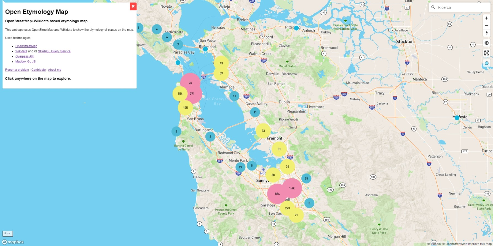
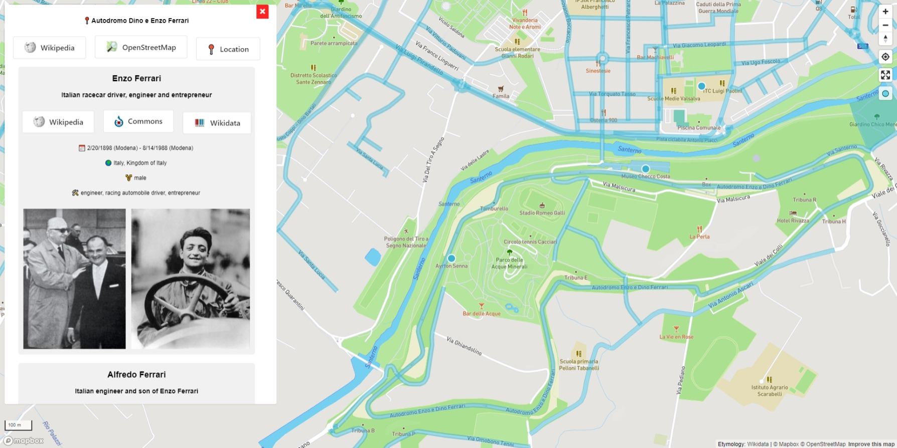
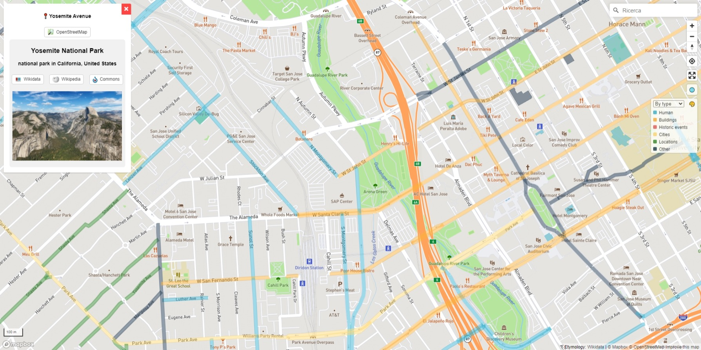
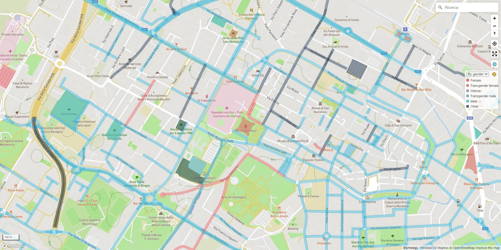

# Open Etymology Map

Interactive map that shows the etymology of streets and points of interest based on OpenStreetMap and Wikidata.

By default the user language is used when fetching etymology details.
You can force the another language by passing the [ISO-639 + ISO-3166 localization code](http://www.lingoes.net/en/translator/langcode.htm) to the `lang` parameter.
For example https://www.dsantini.it/etymology/?lang=es-ES#11.7135,44.3414,15.1 passes `es-ES` to require data in spanish.

## Used technologies

- [OpenStreetMap](https://www.openstreetmap.org/about) and its [`name:etymology:wikidata`](https://wiki.openstreetmap.org/wiki/Key:name:etymology:wikidata) and [`subject:wikidata`](https://wiki.openstreetmap.org/wiki/Key:subject) tags
- [Wikidata](https://www.wikidata.org/wiki/Wikidata:Introduction) and its [SPARQL Query Service](https://www.wikidata.org/wiki/Wikidata:SPARQL_query_service)
- [Overpass API](https://wiki.openstreetmap.org/wiki/Overpass_API)
- [Mapbox GL JS](https://www.mapbox.com/mapbox-gljs)

For more details see [CONTRIBUTING.md](CONTRIBUTING.md).

## Screenshots

 |
