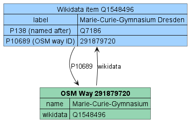
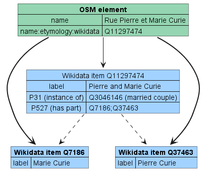

# OSM-Wikidata Map Framework

Framework for creating interactive maps that shows details about map elements based on OpenStreetMap and Wikidata.

For an example of usage, check out the existing implementations:

- [Open Etymology Map](https://gitlab.com/openetymologymap/open-etymology-map)
- [Open Burial Map](https://gitlab.com/openetymologymap/open-burial-map)

By default the user language is used when fetching etymology details.
You can force the another language by passing the [ISO-639 + ISO-3166 localization code](http://www.lingoes.net/en/translator/langcode.htm) to the `lang` parameter.
For example https://etymology.dsantini.it/?lang=es-ES passes `es-ES` to require data in spanish.

## Available data source patterns

| Data source pattern                                                                                                                                                                                                                                                                                                                                                                                                                                | Image                                                                                | ID (from DB)                        | ID (from APIs) | Configuration keys                          |
| -------------------------------------------------------------------------------------------------------------------------------------------------------------------------------------------------------------------------------------------------------------------------------------------------------------------------------------------------------------------------------------------------------------------------------------------------- | ------------------------------------------------------------------------------------ | ----------------------------------- | -------------- | ------------------------------------------- |
| [OpenStreetMap](https://www.openstreetmap.org/about) and its [`*:wikidata` tags](https://wiki.openstreetmap.org/wiki/Key:wikidata#Secondary_Wikidata_links) (for example [`name:etymology:wikidata`](https://wiki.openstreetmap.org/wiki/Key:name:etymology:wikidata), [`subject:wikidata`](https://wiki.openstreetmap.org/wiki/Key:subject), [`buried:wikidata`](https://wiki.openstreetmap.org/wiki/Key:wikidata#Secondary_Wikidata_links), ...) |  | `osm_*` (e.g. `osm_name_etymology`) | `overpass`     | `osm_filter_key`, `osm_wikidata_keys`       |
| OpenStreetMap [`wikidata`](https://wiki.openstreetmap.org/wiki/Key:wikidata) tag combined with [Wikidata](https://www.wikidata.org/wiki/Wikidata:Introduction) properties (like [`P138` ("named after")](https://www.wikidata.org/wiki/Property:P138), [`P547` ("commemorates")](https://www.wikidata.org/wiki/Property:P547), [`P825` ("dedicated to")](https://www.wikidata.org/wiki/Property:P825), ...)                                        |                       | `osm_wikidata`                      | :x:            | `osm_filter_key`, `osm_wikidata_properties` |
| Case insensitive search of names used by multiple roads far from each other which have exactly and only the same etymology (obtained from the sources above) and propagation of that etymology to all elements with the same name                                                                                                                                                                                                                  |                                     | `propagated`                        | :x:            | `osm_filter_key`, `propagate_data`          |
| Propagation of etymolgies to entities which are part of the original group etymology (e.g. married couple, couple of brothers, ...)                                                                                                                                                                                                                                                                                                                |                                   | Inherits the ID                     | :x:            |                                             |
| All sources listed above                                                                                                                                                                                                                                                                                                                                                                                                                           |                                                                                      | `all_db`                            | :x:            |
| Wikidata entities with the property [`P625` ("coordinate location")](https://www.wikidata.org/wiki/Property:P625) and one of the properties seen above                                                                                                                                                                                                                                                                                             |                          | :x:                                 | `wd_direct`    | `osm_wikidata_properties`                   |
| Wikidata entities with the property `P625` referenced by an etymology entity with reverse properties (like [`P119` ("place of burial")](https://www.wikidata.org/wiki/Property:P119), ...)                                                                                                                                                                                                                                                         |                        | :x:                                 | `wd_reverse`   | `wikidata_indirect_property`                |
| Wikidata property `P625` used as qualifier for reverse properties (like `P119`, ...)                                                                                                                                                                                                                                                                                                                                                               |                    | :x:                                 | `wd_qualifier` | `wikidata_indirect_property`                |

For more details see [CONTRIBUTING.md](CONTRIBUTING.md).

## Technologies used for data elaboration and display

- [Wikidata SPARQL Query Service](https://www.wikidata.org/wiki/Wikidata:SPARQL_query_service)
- [Overpass API](https://wiki.openstreetmap.org/wiki/Overpass_API)
- [Wikimedia REST API](https://en.wikipedia.org/api/rest_v1/)
- Python + [Apache Airflow](https://airflow.apache.org/)
- PHP + PostGIS
- Typescript + [Mapbox GL JS](https://www.mapbox.com/mapbox-gljs)

## Screenshots

Detail view:

Color grouping by gender:

Color grouping by type:

Cluster view:

