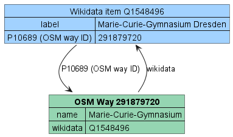
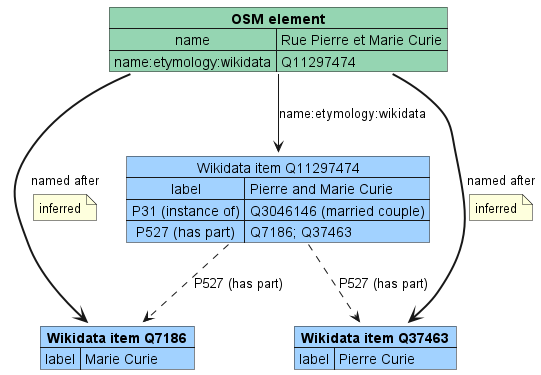
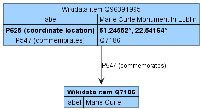
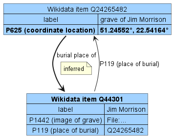

# OSM-Wikidata Map Framework

Framework for creating interactive maps that combine and display details about entities associated with geographic features from OpenStreetMap and Wikidata. The types of geographic features and related entities to show are choosen by editing a configuration file and automatically handled by the framework.

## Available data source patterns

| Data source pattern                                                                                                                                                                                                                                                                                                                                                                                                                                                                                                                                                                                                  | Image                                                                                | ID (from DB)      | ID (from APIs) |
| -------------------------------------------------------------------------------------------------------------------------------------------------------------------------------------------------------------------------------------------------------------------------------------------------------------------------------------------------------------------------------------------------------------------------------------------------------------------------------------------------------------------------------------------------------------------------------------------------------------------- | ------------------------------------------------------------------------------------ | ----------------- | -------------- |
| [OpenStreetMap](https://www.openstreetmap.org/about) and its [`*:wikidata` tags](https://wiki.openstreetmap.org/wiki/Key:wikidata#Secondary_Wikidata_links) (for example [`name:etymology:wikidata`](https://wiki.openstreetmap.org/wiki/Key:name:etymology:wikidata), [`subject:wikidata`](https://wiki.openstreetmap.org/wiki/Key:subject), [`buried:wikidata`](https://wiki.openstreetmap.org/wiki/Key:wikidata#Secondary_Wikidata_links), ...). [Can be configured](.env.example) with `osm_wikidata_keys` (JSON array of OSM \*:wikidata keys to use) and `osm_filter_key` (OSM key to use to filter elements). |  | `db_osm_*`        | `overpass_osm_*`   |
| OpenStreetMap [`wikidata`](https://wiki.openstreetmap.org/wiki/Key:wikidata) tag combined with [Wikidata](https://www.wikidata.org/wiki/Wikidata:Introduction) properties (like [`P138` ("named after")](https://www.wikidata.org/wiki/Property:P138), [`P547` ("commemorates")](https://www.wikidata.org/wiki/Property:P547), [`P825` ("dedicated to")](https://www.wikidata.org/wiki/Property:P825), ...). [Can be configured](.env.example) with `osm_wikidata_properties` (JSON array of Wikidata property P-IDs to use) and `osm_filter_key` (OSM key to use to filter elements).                               |                       | `db_osm_wikidata` | :x:            |
| Case insensitive search of names used by multiple roads far from each other which have exactly and only the same etymology (obtained from the sources above) and propagation of that etymology to all elements with the same name. [Can be configured](.env.example) with `propagate_data` (switch to enable or disable propagation) and `osm_filter_key` (OSM key to use to filter elements).                                                                                                                                                                                                                       |                                     | `db_propagated`   | :x:            |
| Propagation of etymolgies to entities which are part of the original group etymology (e.g. married couple, couple of brothers, ...)                                                                                                                                                                                                                                                                                                                                                                                                                                                                                  |                                   | Inherits the ID   | :x:            |
| All available sources amongst those listed above, conflated. This is the only source available for the clustered low-zoom-level view of the map ("global map").                                                                                                                                                                                                                                                                                                                                                                                                                                                                               |                                                                                      | `db_all`          | `overpass_all` |
| Wikidata entities with the property [`P625` ("coordinate location")](https://www.wikidata.org/wiki/Property:P625) and specific properties. [Can be configured](.env.example) with `osm_wikidata_properties` (JSON array of Wikidata property P-IDs to use).                                                                                                                                                                                                                                                                                                                                                          |                          | :x:               | `wd_direct`    |
| Wikidata entities with the property `P625` referenced by an etymology entity through reverse properties (like [`P119` ("place of burial")](https://www.wikidata.org/wiki/Property:P119), ...). [Can be configured](.env.example) with `wikidata_indirect_property` (Wikidata property P-ID to use).                                                                                                                                                                                                                                                                                                                  |                        | :x:               | `wd_reverse`   |
| Wikidata property `P625` used as qualifier for reverse properties (like `P119`, ...). [Can be configured](.env.example) with `wikidata_indirect_property` (Wikidata property P-ID to use) and `wikidata_image_property` (Wikidata property P-ID to use to get an image of the map feature).                                                                                                                                                                                                                                                                                                                          |                    | :x:               | `wd_qualifier` |
| Last two Wikidata sources listed above (Wikidata property `P625` used as qualifier for reverse properties + entities with `P625` referenced by an etymology entity through reverse properties), conflated. [Can be configured](.env.example) with `wikidata_indirect_property` and `wikidata_image_property`.                                                                                                                                                                                                                                                                                                         |                                                                                      | :x:               | `wd_indirect`  |

For more details see [CONTRIBUTING.md](CONTRIBUTING.md).

## How to use this framework to create a map

The most basic deployment can be launched by using Docker and executing these shell commands:

1. Create the `.env` configuration file from the template ([.env.example](.env.example))
   ```sh
   curl -o .env https://gitlab.com/openetymologymap/osm-wikidata-map-framework/-/raw/main/.env.example
   ```
2. Edit the file `.env` to configure your map
   - set the OSM keys and Wikidata properties you want to use (as documented [above](#available-data-source-patterns)) in the "Data source" section
   - set a valid [Mapbox access token](https://docs.mapbox.com/help/getting-started/access-tokens/) (needed for the map) in `mapbox_token`
   - other configuration keys should be fine but can be edited to customize the web application
   - take inspiration from configurations of other projects like [Open Etymology Map](https://gitlab.com/openetymologymap/open-etymology-map/-/blob/main/.env.example), [Open Burial Map](https://gitlab.com/openetymologymap/open-burial-map/-/blob/main/.env.example), ...
3. Launch the docker image of the framework
   ```sh
   docker run --rm --env-file ".env" -p "80:80/tcp" "registry.gitlab.com/openetymologymap/osm-wikidata-map-framework:latest"
   ```
   The web application will be accessible at http://localhost

For more advanced deployment configurations check [CONTRIBUTING.md](CONTRIBUTING.md#deployment).

By default the user language is used when fetching etymology details.
You can force the another language by passing the [RFC 5646 language code](https://datatracker.ietf.org/doc/html/rfc5646) to the `lang` parameter.
For example https://etymology.dsantini.it/?lang=es-ES passes `es-ES` to require data in spanish.

## Technologies used for data elaboration and display

- [Wikidata SPARQL Query Service](https://www.wikidata.org/wiki/Wikidata:SPARQL_query_service)
- [Overpass API](https://wiki.openstreetmap.org/wiki/Overpass_API)
- [Wikimedia REST API](https://en.wikipedia.org/api/rest_v1/)
- Python + [Apache Airflow](https://airflow.apache.org/)
- PHP + PostGIS
- Typescript + [Mapbox GL JS](https://www.mapbox.com/mapbox-gljs)

## Screenshots

Detail view:
[](https://etymology.dsantini.it/#13.404,52.519,16.0,blue)

Color grouping by gender:
[](https://etymology.dsantini.it/#13.385,52.517,13.3,gender)

Color grouping by type:
[](https://etymology.dsantini.it/#13.385,52.517,13.3,type)

Cluster view:
[](https://etymology.dsantini.it/#6.460,50.839,6.0,blue)
