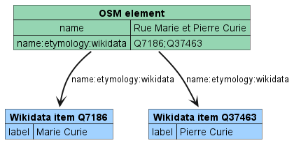

# OSM-Wikidata Map Framework

Framework for creating interactive maps that combine and display details about entities associated with geographic features from OpenStreetMap and Wikidata. The types of geographic features and related entities to show are choosen by editing a configuration file and automatically handled by the framework.

## Available data source patterns

| Data source pattern | Image |
| ------------------- | ----- |
| [OpenStreetMap](https://www.openstreetmap.org/about) elements linked to related entities through [`*:wikidata` keys](https://wiki.openstreetmap.org/wiki/Key:wikidata#Secondary_Wikidata_links) (for example [`name:etymology:wikidata`](https://wiki.openstreetmap.org/wiki/Key:name:etymology:wikidata)). Can be configured [with `osm_wikidata_keys`](.env.example) (JSON array of OSM keys to use). |  |
| Wikidata entities with the property [`P625` ("coordinate location")](https://www.wikidata.org/wiki/Property:P625) and specific properties linking to related entities. Can be configured [with `osm_wikidata_properties`](.env.example) (JSON array of Wikidata property P-IDs to use). |  | `wd_direct`    |
| OpenStreetMap [`wikidata=*`](https://wiki.openstreetmap.org/wiki/Key:wikidata) tag combined with [Wikidata](https://www.wikidata.org/wiki/Wikidata:Introduction) direct properties. Can be configured [with `osm_wikidata_properties`](.env.example) (JSON array of Wikidata property P-IDs to use). |  |
| Wikidata entities with the property `P625` referenced by a related entity through reverse properties (for example [`P119` ("place of burial")](https://www.wikidata.org/wiki/Property:P119)). Can be configured [with `wikidata_indirect_property`](.env.example) (Wikidata property P-ID to use). |  |
| OpenStreetMap [`wikidata`](https://wiki.openstreetmap.org/wiki/Key:wikidata) tag combined with [Wikidata](https://www.wikidata.org/wiki/Wikidata:Introduction) reverse properties. Can be configured [with `wikidata_indirect_property`](.env.example) (Wikidata property P-ID to use). |   |
| Wikidata property `P625` used as qualifier for reverse properties. Can be configured [with `wikidata_indirect_property`](.env.example) (Wikidata property P-ID to use) [and `wikidata_image_property`](.env.example) (Wikidata property P-ID to use to get an image of the map feature).|  |
| Case insensitive search of names used by multiple roads far from each other which have exactly and only the same etymology (obtained from the sources above) and propagation of that etymology to all elements with the same name. Can be enabled/disabled [with `propagate_data`](.env.example). Feature meant specifically for [Open Etymology Map](https://gitlab.com/openetymologymap/open-etymology-map/). |  |

For more details see [CONTRIBUTING.md](CONTRIBUTING.md).

## How to use this framework to create a map

The most basic deployment can be launched by using Docker and executing these shell commands:

1. Create the `.env` configuration file from the template ([.env.example](.env.example))
   ```sh
   curl -o .env https://gitlab.com/openetymologymap/osm-wikidata-map-framework/-/raw/main/.env.example
   ```
2. Edit the file `.env` to configure your map
   - set the OSM keys and Wikidata properties you want to use (as documented [above](#available-data-source-patterns)) in the "Data source" section
   - other configuration keys should be fine but can be edited to customize the web application. If you expose your app on a domain/address different than localhost or 127.0.0.1 you will also need to specify a token/key for the background map (either `mapbox_token`, `maptiler_key`, `enable_stadia_maps` or `jawg_token`)
   - take inspiration from configurations of other projects like [Open Etymology Map](https://gitlab.com/openetymologymap/open-etymology-map/-/blob/main/.env.example), [Open Burial Map](https://gitlab.com/openetymologymap/open-burial-map/-/blob/main/.env.example), [Open Artist Map](https://gitlab.com/openetymologymap/open-artist-map/-/blob/main/.env.example), [Open Architect Map](https://gitlab.com/openetymologymap/open-architect-map/-/blob/main/.env.example), ...
3. Launch the docker image of the framework
   ```sh
   docker run --rm --env-file ".env" -p "80:80/tcp" "registry.gitlab.com/openetymologymap/osm-wikidata-map-framework:latest"
   ```
   The web application will be accessible at http://localhost

If this process fails for you or you encounter any bug during the process we want to hear from you: please report it on [GitLab](https://gitlab.com/openetymologymap/osm-wikidata-map-framework/-/issues) or [GitHub](https://github.com/Danysan1/osm-wikidata-map-framework/issues).

For more advanced deployment configurations check [CONTRIBUTING.md](CONTRIBUTING.md#deployment).

The framework is fully internationalized.
By default the browser language is used.
You can force another language by passing the [ISO 639-1 language code](https://www.loc.gov/standards/iso639-2/php/code_list.php) to the `lang` parameter.
For example https://etymology.dsantini.it/?lang=es passes `es` to require data in spanish.
Translations for the labels specific to the framework are taken from the files in [public/locales/](public/locales/) (help with new translations is welcome!).
The translated text in the details panel for the map feature selected by the user are taken from from OSM [`name:*=*`](https://wiki.openstreetmap.org/wiki/Multilingual_names) and Wikidata labels.
Translations for the map labels are handled by the map provider (and are typically derived from OSM and/or Wikidata).

## Screenshots

Detail view:
[](https://etymology.dsantini.it/#13.404,52.519,16.0,blue)

Color grouping by gender:
[](https://etymology.dsantini.it/#13.385,52.517,13.3,gender)

Color grouping by type:
[](https://etymology.dsantini.it/#13.385,52.517,13.3,type)

Cluster view:
[](https://etymology.dsantini.it/#6.460,50.839,6.0,blue)
