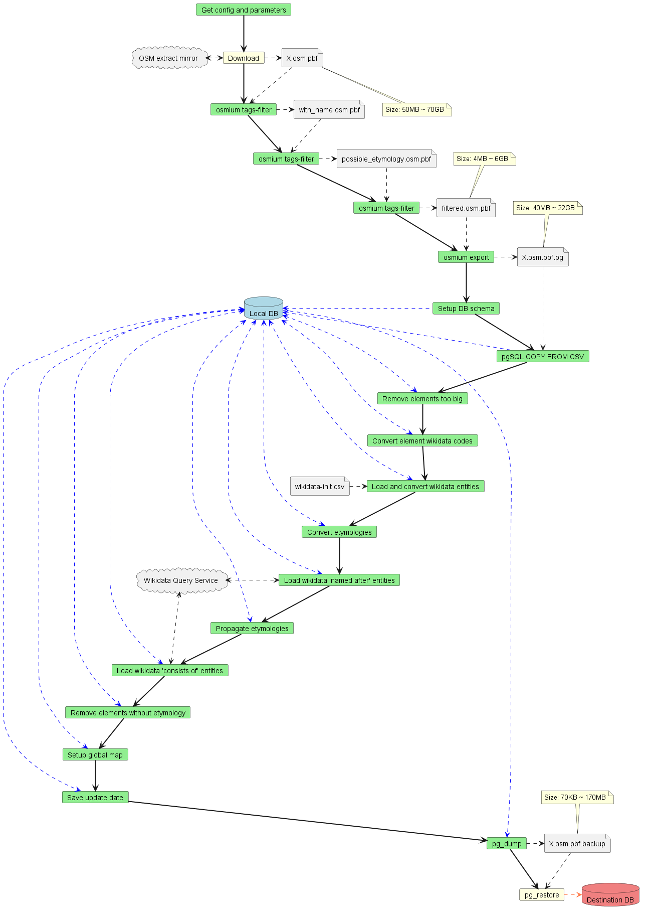

# DB initialization

The code in this folder defines the Apache Airflow data pipelines that are regularly run to download the latest OSM data, initialize the [PostgreSQL](https://www.postgresql.org/)+[PostGIS](https://postgis.net/) DB and get the linked entities and export the result to a PMTiles file used by the front-end.

## Pipeline structure

Each `db-init-*.py` file in the [dags/](./dags/) folder defines the flow for an area of the world. If you need the pipelines for a new area you can request it in an issue or propose it in a PR.
The DB initialization flow for each area is split in three Airflow data pipelines ("DAG"s) that automatically run in sequence once enabled.

1. OSM dump download ([OsmPbfDownloadDAG.py](./dags/OsmPbfDownloadDAG.py), for example `download-planet-from-rss`)
   - This pipeline downloads a .pbf OpenStreetMap dump ([a local extract](https://download.geofabrik.de/) in testing or [a full planet export](https://planet.openstreetmap.org/) in production)
2. OSM dump filtering ([OwmfFilterDAG.py](./dags/OwmfFilterDAG.py), for example `filter-planet`)
   - This pipeline filters the downloaded OSM dump with [`osmium tags-filter`](https://docs.osmcode.org/osmium/latest/osmium-tags-filter.html) to keep only potentially useful data
   - The filtered .pbf is also exported to a tab-separated-values file with [`osmium export`](https://docs.osmcode.org/osmium/latest/osmium-export.html)
3. Data elaboration + Tiles generation ([OwmfDbInitDAG.py](./dags/OwmfDbInitDAG.py), for example `db-init-planet`)
   - This pipeline imports the filtered data into the DB (by default by loading the tab-separated-values file, but it can also be configured to load it from the filtered .pbf with [osm2pgsql](https://osm2pgsql.org/))
   - Then OSM linked entities are extracted from OSM data and downloaded from Wikidata.
   - If enabled, propagation is executed.
   - Then the data is exported to PMTiles through ogr2ogr+[Tippecanoe](https://github.com/felt/tippecanoe).
   - If enabled, the data is uploaded to a remote DB with pg_dump+pg_restore
   - If enabled, the tiles are uploaded to an S3 bucket

Database initialization steps diagram

Please note that this diagram is not up-to-date with the latest changes, for an up-to-date diagram spin up Apache Airflow with the instructions below then open one of these:
* [Graph for the download pipeline](http://localhost:8080/dags/download-planet-from-rss/grid?tab=graph)
* [Graph for the filter pipeline](http://localhost:8080/dags/filter-planet/grid?tab=graph)
* [Graph for the DB init pipeline](http://localhost:8080/dags/db-init-planet/grid?tab=graph)

## Usage

To run the database initialization:

1. make sure [Docker Compose is installed](https://docs.docker.com/compose/install/)
2. initialize `.env` from [`.env.example`](../.env.example) (owmf_source_presets is not yet supported, currently tags and properties for the preset must be specified directly)
3. the first time run `docker compose --profile airflow-init up`, then for each sequent time start Apache Airflow with `docker compose up -d`
4. If you want to upload the tiles to an S3 bucket, [create an access key on AWS IAM](https://docs.aws.amazon.com/IAM/latest/UserGuide/id_credentials_access-keys.html), configure it [in an Airflow AWS connection](http://localhost:8080/variable/list/) called `aws_s3` and configure the URI of the S3 bucket [in an Airflow variable](http://localhost:8080/connection/list/) called `<PREFIX>_base_s3_uri` (for example `planet_base_s3_uri`)
5. Enable the three DAG pipelines for the area you are interested in (for example `download-planet-from-rss`+`filter-planet`+`db-init-planet`)
6. The data for OSM-Wikidata Map Framework will be stored in the `owmf` schema of the DB you configured in `.env`

**IMPORTANT NOTE**: If you use the planet file I suggest to use a machine with 16GB of RAM (and a lot of patience, it will require more than 6 hours; use a local extract in development to use less RAM and time, for an example see [db-init-italy-nord-ovest.py](./dags/db-init-italy-nord-ovest.py)).

Tip: if you run the local development instance through `docker-compose` you can connect to the local DB ([configured by default in `.env`](../.env.example)) by using PGAdmin at http://localhost:8000 .

## Propagation

If the propagation is enabled, the database initialization operates as follow:

1. load all highways with a name, even if they have no etymology
2. find the linked entities of elements on the map through the methods cited above from OSM and Wikidata
3. execute a case insensitive search of names used by at least two highways far away from each other which have exactly and only the same etymology
4. propagates these linked entities to all (case insensitively) homonymous highways

More specifically, this procedure is handled by [`OwmfDbInitDAG`](./dags/OwmfDbInitDAG.py#L606) and [11-propagate-etymologies-global.sql](./dags/sql/11-propagate-etymologies-global.sql).
