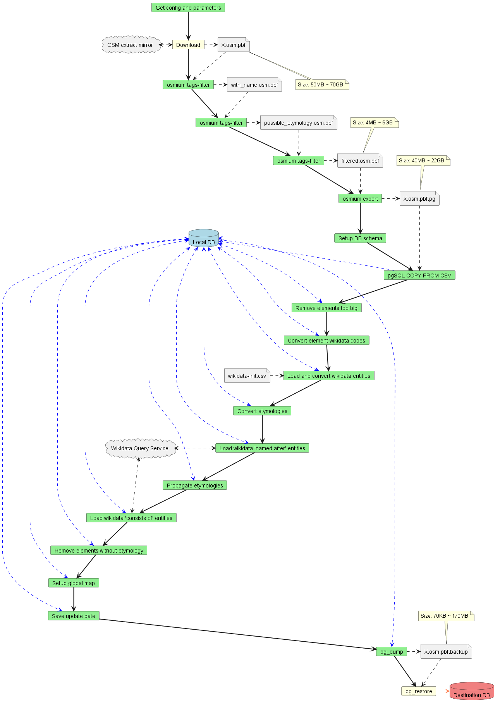

# DB initialization

An Apache Airflow pipeline defined in [dags/](./dags/db-init-planet.py) is regularly run to download the latest OSM data, initialize the [PostgreSQL](https://www.postgresql.org/)+[PostGIS](https://postgis.net/) DB and get the linked entities and export the result to a PMTiles file used by the front-end.

This pipeline starts from a .pbf file ([a local extract](http://download.geofabrik.de/) in testing or [a full planet export](https://planet.openstreetmap.org/) in production), filters it with [`osmium tags-filter`](https://docs.osmcode.org/osmium/latest/osmium-tags-filter.html), exports it to a tab-separated-values file with [`osmium export`](https://docs.osmcode.org/osmium/latest/osmium-export.html) and imports it into the DB. [osm2pgsql](https://osm2pgsql.org/) is also supported in place of `osmium export` but the former is typically used. Then OSM etymologies are extracted and Wikidata etymologies are downloaded. If enabled, propagation is executed. Finally the data is exported to PMTiles through ogr2ogr+[Tippecanoe](https://github.com/felt/tippecanoe) or uploaded to a remote DB with pg_dump+pg_restore. 

To run the database initialization:

1. make sure [`docker-compose` is installed](#local-development-with-docker)
2. initialize `.env` from [`.env.example`](../.env.example)
3. the first time run `docker-compose --profile airflow-init up`, then for each sequent time start Apache Airflow with `docker-compose --profile airflow up -d`
4. from the Apache Airflow configuration menu in the dashboard located at http://localhost:8080 create the Pool `data_filtering`
5. run/enable an existing DAG pipeline (if necessary customizing the launch config)
6. the data for OSM-Wikidata Map Framework will be stored in the `owmf` schema of the DB you configured in `.env` (and, if specified in the destination DB)

IMPORTANT NOTE: If you use the planet file I suggest to use a machine with 16GB of RAM (and a lot of patience, it will require more than 6 hours; use a local extract in development to use less RAM and time, for an example see [db-init-italy-nord-ovest.py](./dags/db-init-italy-nord-ovest.py)).

Tip: if you run the local development instance through `docker-compose` you can connect to the local DB ([configured by default in `.env`](../.env.example)) by using PGAdmin at http://localhost:8000 .

Database initialization steps diagram

## Propagation

If the propagation is enabled, the database initialization operates as follow:

1. load all highways with a name, even if they have no etymology
2. find the etymologies os elements on the map through the methods cited above from OSM and Wikidata
3. case insensitively search names used by at least two highways far away from each other which have exactly and only the same etymology
4. propagates these etymologies to all (case insensitively) homonymous highways

More specifically, this procedure is handled by [`OwmfDbInitDAG`](./dags/OwmfDbInitDAG.py#L424) and [propagate-etymologies-global.sql](./dags/sql/propagate-etymologies-global.sql).
